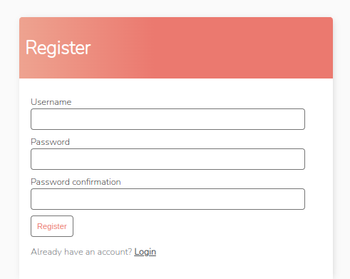
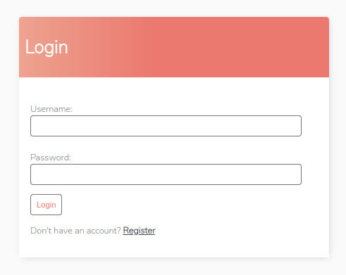
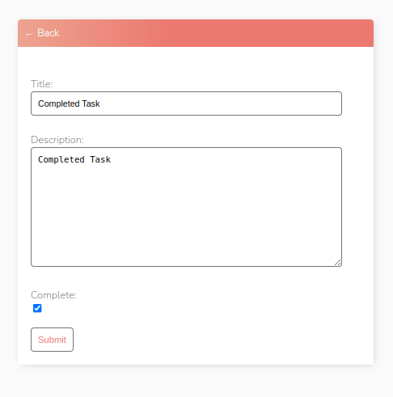
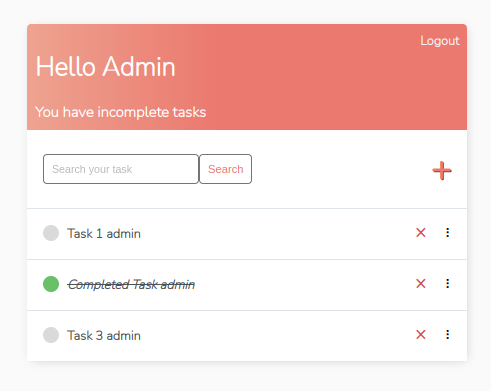
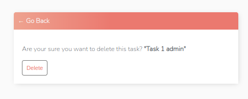

# todo_project
Hello, this is my first project in Django. In this repository, **CRUD** operations on the database are performed.
#
You can register on this site and create your own **personal diary**. That is, you enter what you want to do and you can mark it as done.

# Requirments File

    * asgiref==3.5.2
    * Django==4.1.3
    * psycopg2-binary==2.9.5
    * sqlparse==0.4.3

# Register and Login
This is register and login page. 
 

   
* ***After login you can create your own to do tasks.*** 

This is the task you want to create. Below you will see booleanfield. It indicates that the task has been completed. If you want to change the information of any task, you can change it in the next window by clicking on the relevant line. 

   

In this picture you can see two different tasks. A row painted with a green circle means that it is done. 

   

You can delete the task by clicking the x icon next to it. Such a window will open. It will confirm that you want to delete. 

   

# THE END
